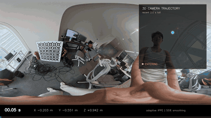
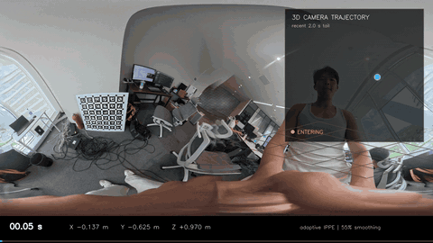
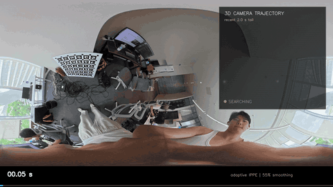
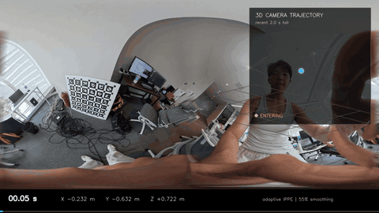

# Osmo 360 AprilTag 轨迹 Demo

从 DJI Osmo 360 全景视频中识别 AprilGrid，估计相机相对标定板的三维位置与姿态，并生成带滤波轨迹的可视化视频。

> 当前结果用于方案验证和模型数据准备，属于 Demo 级轨迹，不作为测量级坐标。

## 真实轨迹演示

动画会在 GitHub 页面中自动播放。点击动画可查看对应的原始 MP4。

### 8

[](sessions/8-trajectory/8_trajectory_overlay.mp4)

有效位姿 43/53（81.1%），中位 RMSE 0.404 px。

[轨迹数据 CSV](sessions/8-trajectory/pose.csv) · [结果摘要 JSON](sessions/8-trajectory/summary.json) · [轨迹图 PNG](sessions/8-trajectory/relative_coordinates.png)

### round

[](sessions/round-trajectory/round_trajectory_overlay.mp4)

有效位姿 36/54（66.7%），中位 RMSE 0.392 px。

[轨迹数据 CSV](sessions/round-trajectory/pose.csv) · [结果摘要 JSON](sessions/round-trajectory/summary.json) · [轨迹图 PNG](sessions/round-trajectory/relative_coordinates.png)

### round2

[](sessions/round2-trajectory/round2_trajectory_overlay.mp4)

有效位姿 1/32（3.1%），中位 RMSE 0.779 px。该片段中标定板倾角较大、有效 Tag 不足，主要用于展示识别失败与轨迹预测状态。

[轨迹数据 CSV](sessions/round2-trajectory/pose.csv) · [结果摘要 JSON](sessions/round2-trajectory/summary.json) · [轨迹图 PNG](sessions/round2-trajectory/relative_coordinates.png)

### w

[](sessions/w-trajectory/w_trajectory_overlay.mp4)

有效位姿 30/37（81.1%），中位 RMSE 0.723 px。

[轨迹数据 CSV](sessions/w-trajectory/pose.csv) · [结果摘要 JSON](sessions/w-trajectory/summary.json) · [轨迹图 PNG](sessions/w-trajectory/relative_coordinates.png)

## 项目能做什么

- 从工厂标定拼接后的 2:1 全景视频识别 AprilGrid
- 输出相机 XYZ、Roll、Pitch、Yaw 和识别质量
- 对短时断点进行轨迹预测和平滑
- 生成轨迹图与真实画面叠加视频
- 保留逐帧结果，方便后续模型训练和轨迹回放

输入可以是 PanoForge 使用相机工厂标定生成的全景 MP4，也可以是 DJI Studio 导出的 2:1 全景 MP4。原始 OSV、中间全景、remap 和缓存不包含在仓库中。

## 快速开始

```bash
sudo apt install ffmpeg gstreamer1.0-tools gstreamer1.0-libav gstreamer1.0-plugins-ugly
curl -LsSf https://astral.sh/uv/install.sh | sh

git clone https://github.com/zcxixixi/osmo-360-apriltag-pose.git
cd osmo-360-apriltag-pose
uv sync --extra test
```

### 原始视频一键生成数据集

DJI Osmo 360 的 `.OSV` 可以直接作为输入。入口会自动识别相机，调用本地
PanoForge 从 `djmd` 提取工厂标定和 IMU，把两路鱼眼做真实 remap + 接缝融合，
再解算逐帧 6DoF 并打包数据集。不会通过修改扩展名伪装成已拼接视频。

```bash
./camera-to-dataset /path/to/CAM_xxx_D.OSV \
  --run-name robot-motion-001
```

默认 AprilGrid 是 6×6、黑色编码区 88 mm、间距比例 0.30。使用四个独立大
Tag 时传入明确地图，不能自动猜测实际尺寸和安装位置：

```bash
./camera-to-dataset /path/to/CAM_xxx_D.OSV \
  --tag-map mocap-evaluation/config/insta360_x6_tag_map.json \
  --run-name four-tag-motion-001
```

输入识别规则：

- `.OSV`：DJI 原始双鱼眼，执行 PanoForge 工厂标定拼接；
- `.insv` / `.lrv`：识别为 Insta360 原始文件，并明确返回“等待官方 SDK”，
  当前不会用通用投影生成近似结果；
- 已经是 2:1 的 MP4：跳过原始鱼眼拼接，直接进入轨迹和数据集阶段。

输出位于 `camera-datasets/<run-name>/dataset/`：

- `media/panorama.mp4`：3840×1920 H.264 工厂标定全景；
- `annotations/trajectory_6dof.csv`：直接测量、光流、短缺口恢复、预测和失锁状态，
  同时包含板坐标系与“第一帧为原点”的 Kalman + RTS 位置/四元数；
- `annotations/pose_direct.csv`、`detections.jsonl`：原始可审计视觉结果；
- `calibration/`、`sensor/`：DJI 工厂标定和两档 IMU 数据；
- `metadata.json`：数据集版本、坐标系、状态定义、输入身份和统计；
- `previews/trajectory_overlay.mp4`：夹爪模型 6DoF 动画预览。

加 `--extract-frames` 才会把采样帧另存为 JPEG；默认保留 MP4 + 时间戳 CSV，
避免数据集无意义膨胀。小规模验证可加 `--max-processed-frames 60`，确认后去掉
该参数跑全量。

运行离线轨迹识别：

```bash
uv run python osmo_360_offline.py input_360.mp4 \
  --tag-size 0.088 \
  --spacing 0.30 \
  --sample-fps 5 \
  --output-dir sessions \
  --official-stitched
```

生成轨迹叠加视频：

```bash
uv run python render_trajectory_overlay_video.py \
  input_360.mp4 sessions/example/pose.csv sessions/example/overlay.mp4 \
  --fps 20 --smooth 0.55 --tail-seconds 2
```

也可以启动本地控制页面：

```bash
uv run python control_app.py
```

然后打开 <http://127.0.0.1:7860>。

## 输出文件

- `pose.csv`：逐帧位置、姿态和识别质量
- `summary.json`：有效率、RMSE 和整体统计
- `relative_coordinates.png`：三维及平面轨迹图
- `overlay.mp4`：真实视频与三维轨迹叠加结果

## Insta360 X6 与 OptiTrack 真值评估

项目支持非连续 AprilTag ID 的显式地图，并将视觉轨迹与 Motive 多行表头 CSV 做严格的留出集评估。单 Tag、光流和预测帧不会进入精度统计。

### 一键运行（推荐）

```bash
uv sync --extra test
# 可选：首次安装 CUDA 依赖体积较大
uv sync --extra gpu

./x6-mocap-evaluate \
  /path/to/VID_NO_FLOWSTATE.mp4 \
  /path/to/motive.csv \
  --confirm-flowstate-off \
  --run-name experiment-001
```

命令会依次执行：

1. 50 fps 双 Tag 直接视觉解算；
2. Motive 异常分支隔离与线/角速度时间同步；
3. 前 30% 手眼外参标定、后 70% 冻结外参评估；
4. Kalman 前向滤波 + RTS 后向平滑；
5. OptiTrack/视觉双 CAD 夹爪 H.264 对比视频。

默认输出到 `mocap-runs/<run-name>/`。再次执行同一命令会复用已经完成的阶段；使用 `--force` 重跑，或通过 `--from-stage evaluate` / `--from-stage render` 从指定阶段继续。`--dry-run` 只做预检查并打印实际命令。

> `--confirm-flowstate-off` 是有意设置的保护开关。FlowState、方向锁定和地平线校正必须在 Insta360 Studio 导出时关闭，否则姿态评估无效。

主要输出：

- `visual/pose.csv`：50 fps 直接解码、双向光流测量及 LOST 状态（由 `measurement_source` 区分）；
- `evaluation/mocap_evaluation.json`：正式精度与质量门槛；
- `evaluation/matched_errors.csv`：逐帧真值/视觉匹配；
- `evaluation/optitrack_vs_visual_gripper_kalman_rts.mp4`：双夹爪对比视频；
- `pipeline_manifest.json`：输入、参数、输出和最终指标；
- `pipeline.log`：完整运行日志。

夹爪 STL 已打包在 `assets/gripper/`，无需依赖外部 URDF 工程。

### 分阶段手动运行

```bash
# 机型自适应模式：DJI 3K 使用 CPU 解码/投影，X6 8K 使用 CPU 解码/CUDA 投影
# 两者均使用4路全局扫描、50 fps双向LK、每3帧重解码；NVDEC可显式试验
# 配置中包含 130 → 131 → 129 → 128 的实际排列
uv run python osmo_360_offline.py input.mp4 \
  --tag-map mocap-evaluation/config/insta360_x6_tag_map.json \
  --sample-fps 50 --min-tags 2 --pnp-points corners --pnp-solver ippe \
  --view-size 1440 --max-rmse-px 8 --global-search-size 720 \
  --horizontal-fov-deg 125 --max-speed 10 --official-stitched

# 前30%求刚体→相机外参，后70%独立统计；正式精度只接受direct
uv run python evaluate_insta360_mocap.py session/pose.csv motive.csv \
  --output-dir evaluation-result --initial-time-offset -3.852

# 生成带 MEASURED / LOST / RECOVERED 审计状态的同步视频
uv run python render_mocap_comparison.py input.mp4 session/pose.csv evaluation-result \
  --output evaluation-result/comparison.mp4
```

只有线速度/角速度综合相关性不低于 0.80、时间偏移不确定度不高于20 ms、且测试段直接双 Tag 匹配不少于200帧时，报告才标记为 `FORMAL_ACCURACY`；否则所有误差只标记为 `DIAGNOSTIC_ONLY`。`optical_flow` 只用于连续轨迹和可视化；即使手动使用 `--include-optical-flow`，评估也会强制标记为诊断结果。可通过 `--camera-model`、`--decoder` 和 `--projection-backend` 覆盖自动策略。

## 注意

轨迹精度会受到全景拼接、运动模糊、标定板倾角、可见 Tag 数量和拍摄距离影响。使用时应同时关注有效位姿比例、RMSE、轨迹连续性和整体运动趋势。

## 测试

```bash
uv run pytest
```
